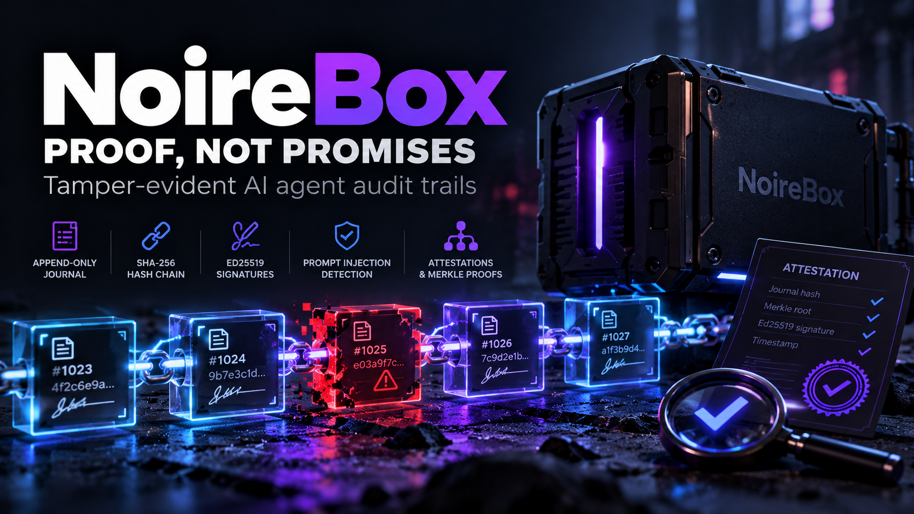
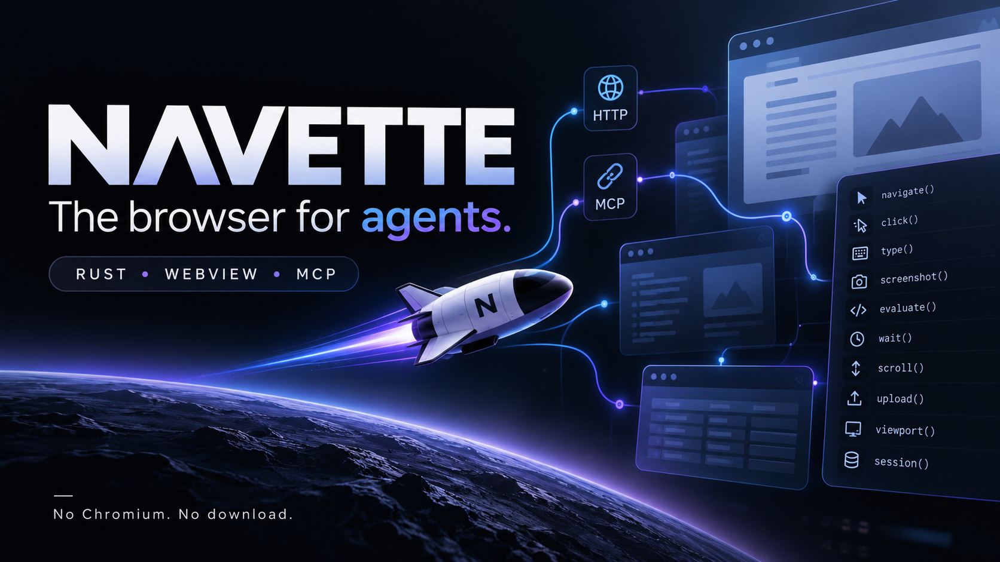

<h1 align="center">🐏 Sam LABBE</h1>

I build <strong>black boxes for systems nobody can fully trust</strong> — right now, that means AI agents.

> The exploit lives in the gap between what your AI reads and what it's allowed to do.
> The cover-up lives in the gap between what it did and what its logs say.
> **I build for the second gap.**

## 🏪 The storefront

Two products. Both do one thing. Both ship receipts.

<table>
  <tr>
    <td width="50%" valign="top">
      
      
An agent does something it shouldn't. Three weeks later, someone asks <em>"what exactly did it do?"</em> — and the only witness is a log written by the suspect. <a href="https://github.com/noirebox/noirebox"><b>NoireBox</b></a> is a hash-chained, Ed25519-signed journal of agent decisions, anchored by third-party RFC 3161 timestamps — one TSA seal covers a whole fleet. Exports are attestations anyone can verify: tamper with the journal and verification explodes. On purpose. MCP server, plugins, API and dashboard included.

      

        
        
        
        
        
      

      
<code>pip install noirebox</code> · <code>docker run -p 8768:8768 ghcr.io/noirebox/noirebox</code>

      
<strong>The honesty bit:</strong> tamper-evidence is not truth-at-write. NoireBox proves records <em>weren't altered</em> — it can't vouch that a record was accurate when sealed. That boundary is written down in the <a href="https://github.com/noirebox/noirebox/blob/main/docs/THREAT-MODEL.md">threat model</a>, on purpose.

    </td>
    <td width="50%" valign="top">
      
      
Your agent needs a browser. Playwright ships <b>218 MB</b> of Chromium; <a href="https://github.com/slabbdev/navette"><b>Navette</b></a> is <b>one 626 KB Rust binary</b> driving the WebView your OS already ships — no Chromium, no download, no RAM bonfire. 18 MCP tools: navigate, read, click, type, screenshot — with native input on all three engines and session isolation CI-enforced.

      

        
        
        
        
      

      
<code>brew install slabbdev/tap/navette</code> · <code>cargo install navette-browser</code> · <code>docker run -i --rm ghcr.io/slabbdev/navette navette mcp</code>

      
<strong>Measured, not vibed:</strong> <a href="https://github.com/slabbdev/navette/blob/main/BENCHMARKS.md">BENCHMARKS.md</a> — faster than Playwright + Chromium on every metric measured, reproducible with one command. The walled-web Tollbooth bench (200 URLs × 5 categories) ships in <a href="https://github.com/slabbdev/navette/tree/main/bench">bench/</a>, dataset CC BY 4.0.

    </td>
  </tr>
</table>

## 🧳 Also in the hangar

- **[tinyjsapp-studio](https://github.com/slabbdev/tinyjsapp-studio)** — desktop companion for [tinyjs](https://github.com/tarwin/tinyjsapp): create tinyjs apps and wrap any website into a real ~6 MB native desktop app — no terminal, menu-bar apps included. Built with tinyjs itself, so `src/` doubles as the tutorial. [v0.1.1](https://github.com/slabbdev/tinyjsapp-studio/releases/tag/v0.1.1) is out, installers for all three platforms · [site](https://slabbdev.github.io/tinyjsapp-studio/).
- **[zerojour](https://github.com/slabbdev/zerojour)** — security-advisories agent built for the DEV × Sanity Challenge: head-to-head model duels on structured content, scored eval runs. Every demo frame is a real capture.
- **[pluginforge](https://github.com/slabbdev/pluginforge)** — quality-first factory for e-commerce payment plugins: one spec, one conformance suite, AI-agent generation under strict gates.
- **[mineral-starter-kit](https://github.com/slabbdev/mineral-starter-kit)** — batteries-included starter for the [Mineral](https://github.com/mineral-dart/mineral) Dart framework.

## 🧰 Stack & scars

Python · Rust · TypeScript · JavaScript · Dart · a long PHP past (Laravel, Symfony — I don't flinch at legacy anymore). Solo, from the Vosges mountains 🇫🇷.

## 📡 Elsewhere

[slabb.dev](https://slabb.dev) · [DEV](https://dev.to/slabb) · [X](https://x.com/slabbbbbbbbbbbb) · [☕ buymeacoffee.com/samlabbe](https://buymeacoffee.com/samlabbe)

---

<em>Every claim on this page ships with receipts.</em>

